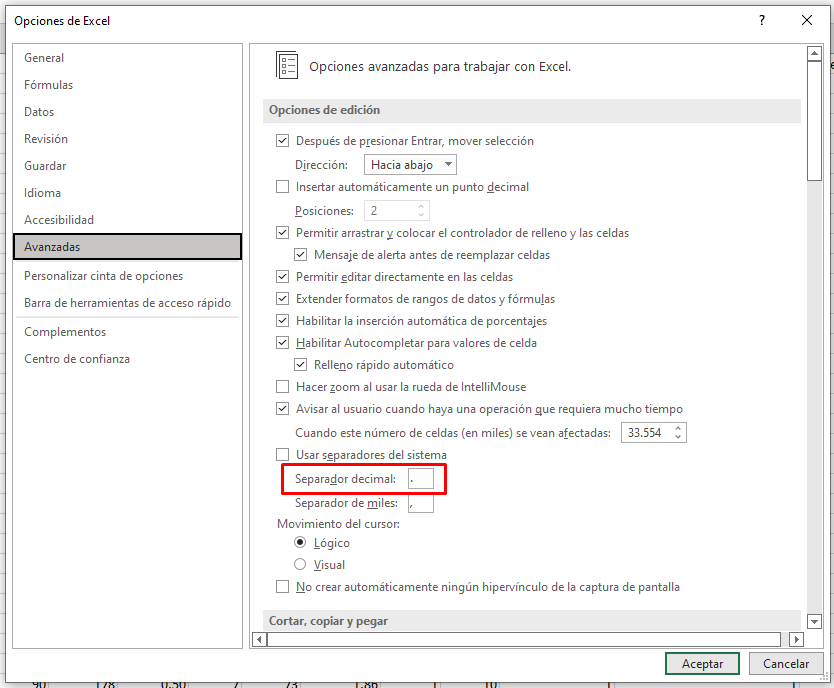
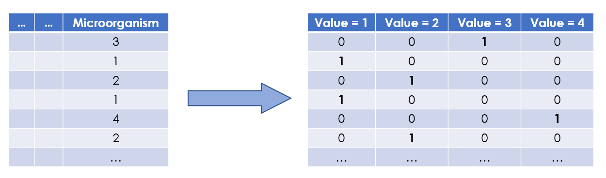
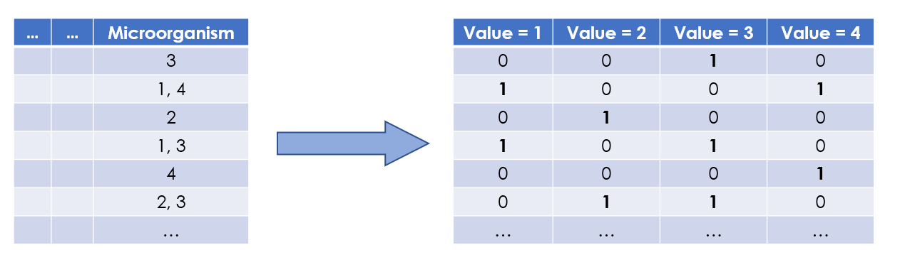

- - - - - - - - - - - - - - - - - - - - - - - - - - - - - - - - - - - - - - - - - - - - - - - - - - - - - - - - -

**Autor:** Jesús Guerrero Quirós

**Tutores del trabajo:** Juan Antonio Nepomuceno Chamorro y Juan Antonio Nepomuceno Chamorro

**Titulación:** Máster Oficial en Ingeniería Biomédica y Salud Digital

**Centro:** Escuela Técnica Superior de Ingeniería Informática

Universidad de Sevilla | Curso 2022/2023

- - - - - - - - - - - - - - - - - - - - - - - - - - - - - - - - - - - - - - - - - - - - - - - - - - - - - - - - -


# **INTRODUCCIÓN**

Este trabajo está estructurado en 4 scripts:

+ Introducción.
+ Estudio de la variable *Vasopressors*.
+ Estudio de la variable *SOFA*.
+ Estudio de la variable *Outcome*.


En este primer script veremos algunos aspectos introductorios, tales como la carga de los datos y una breve exploración inicial.


```{r}
rm(list = ls())
```


## **1. CARGA DE DATOS**

En primer lugar, cargamos los datos en nuestro notebook. Para cargar los datos se puede utilizar la función *read.csv*, indicando que la primera fila de nuestro archivo csv la conforman los headers de las columnas, y que el carácter usado para separar dichas columnas es un punto y coma.


```{r}
dataset_original <- read.csv(file = "dataset_dummy.csv", header = TRUE, sep = ";")
```


Este se trata de un dataset modificado, ya que hay varios aspectos a tener en cuenta con respecto al original:


#### **1.1. Carácter de separación**

En el dataset original, los valores decimales estaban separados por coma, lo cual generaba problemas para importar el archivo en R.

Para solucionar esto, se estableció desde el propio archivo excel que los valores **decimales deben tener como carácter de separación un punto.**

La forma de hacerlo es la siguiente: *Archivo > Opciones > Avanzadas > Separador decimal,* tal y como se muestra en la siguiente imagen:





#### **1.2. Variables dummy**

Hay dos columnas que generan conflictos: *Anatomical site of infection* y *Microorganism*. El motivo es que ambas variables contienen más de un valor para algunas instancias.

Por este motivo, se propone el uso de lo que se conoce como *variables dummy,* que son variables categóricas que sirven para indicar la clase a la que pertenece una instancia. Resulta muy útil en estos casos, puesto que permite crear una nueva variable (columna) para cada posible valor.

Vamos a verlo con un ejemplo de este propio dataset. La variable *Microorganism* tiene 4 posibles valores:

+ 1 = Gram positivo
+ 2 = Gram negativo
+ 3 = Sin especificar
+ 4 = Viral

Sin embargo, es posible que en un paciente estén presentes más de un tipo de microorganismo al mismo tiempo. Si, por ejemplo, se encontrasen gram positivo y negativo, el valor de la variable para esa instancia sería: 1, 2.

Si creamos variables dummy, conseguiríamos añadir una variable para cada posible valor, de manera que podríamos indicar con un 1 si el microorganismo está presente, y con un 2 si no lo está. Es decir, **pasamos de 1 variable con 4 posibles valores, a 4 variables binarias.** Para el ejemplo descrito quedaría de la siguiente forma:

+ gram_positivo --> 1 (el paciente sí tiene microorganismos gram positivo)
+ gram_negativo --> 1 (el paciente sí tiene microorganismos gram negativo)
+ sin_especificar --> 2 (el paciente NO tiene microorganismos sin especificar)
+ viral --> 2 (el paciente NO tiene microorganismos virales)

De esta forma, eliminamos el problema de que una instancia tenga más de un valor sin perder datos.



Sin embargo, hay otro inconveniente: los valores de esas instancias vienen separados por comas, lo cual supone un problema para importar los datos. Por este motivo, no es posible aplicar la función *dummyVars*, que sería lo más sencillo.

Así, se han añadido esas variables dummy de forma manual desde el propio fichero de datos, utilizando fórmulas de Excel. Cabe destacar que esto es una solución provisional y que, aunque da resultado, no es la manera más apropiada ya que no es escalable a otros casos.




## **2. MANIPULACIÓN DEL DATASET**

Después de analizar brevemente nuestro dataset, es necesario realizar algunas modificaciones para poder aplicar los algoritmos correctamente:

+ Eliminar la columna *ID* para diferenciar las instancias.
+ Eliminar las columnas *Anatomical site of infection* y *Microorganism*, ya que las hemos sustituido por las variables dummy correspondientes.
+ Modificar el valor de las variables dummy, de forma que los posibles valores sean 1 y 2, para que esté en concordancia con el resto de variables.

Para ello, utilizaremos la librería *dplyr*, que es muy útil para la manipulación del dataset:

```{r}
library(dplyr)
```


```{r}
dataset <- dataset_original %>% 
  mutate(ID = NULL) %>%
  mutate(Anatomical.site.of.infection = NULL) %>%
  mutate(Microorganism = NULL) %>%
  mutate(Infection_Lungs = ifelse(Infection_Lungs==1, 1, 2)) %>%
  mutate(Infection_Urinary = ifelse(Infection_Urinary==1, 1, 2)) %>%
  mutate(Infection_Muscle = ifelse(Infection_Muscle==1, 1, 2)) %>%
  mutate(Infection_Brain = ifelse(Infection_Brain==1, 1, 2)) %>%
  mutate(Infection_Heart = ifelse(Infection_Heart==1, 1, 2)) %>%
  mutate(Infection_Intestinal = ifelse(Infection_Intestinal==1, 1, 2)) %>%
  mutate(Infection_Unspecified = ifelse(Infection_Unspecified==1, 1, 2))
```


De esta manera, pasamos a tener 38 variables, en lugar de las 41 que teníamos anteriormente.


## **3. EXPLORACIÓN INICIAL**

Como se puede comprobar, nuestro dataset contiene 364 instancias, y 41 variables de estudio:

```{r}
dim(dataset)
```

Además, todas las variables son numéricas.

```{r}
str(dataset)
```

Resumen de las variables:

```{r}
summary(dataset)
```


```{r}
table(dataset$Sex)
```


```{r}
table(dataset$cancer)
```


```{r}
table(dataset$Vasopressors)
```


Un aspecto interesante que puede resultarnos útil para obtener conclusiones de los algoritmos es la distribución de las variables dependientes:

```{r}
num_instancias <- dim(dataset)[1]
```


+ **Distribución de pacientes con shock séptico:**


```{r}
distrib_shock_septico <- table(dataset$Vasopressors)  # Vasopresores (shock séptico) --> 1 = SÍ | 2 = NO
distrib_shock_septico
```

```{r}
c((distrib_shock_septico[1]/num_instancias)*100, (distrib_shock_septico[2]/num_instancias)*100)
```

Aproximadamente, un 18% de los pacientes de nuestro conjunto de datos SÍ ha sufrido un shock séptico, mientras que casi el 82% NO lo ha sufrido.


+ **Distribución de pacientes con insuficiencia orgánica:**


```{r}
distrib_fallo_organico <- table(dataset$SOFA.score)  # Puntuación SOFA 
distrib_fallo_organico
```


```{r}
c((distrib_fallo_organico[1]/num_instancias)*100, (distrib_fallo_organico[2]/num_instancias)*100,
  (distrib_fallo_organico[3]/num_instancias)*100, (distrib_fallo_organico[4]/num_instancias)*100,
  (distrib_fallo_organico[5]/num_instancias)*100, (distrib_fallo_organico[6]/num_instancias)*100,
  (distrib_fallo_organico[7]/num_instancias)*100, (distrib_fallo_organico[8]/num_instancias)*100,
  (distrib_fallo_organico[9]/num_instancias)*100, (distrib_fallo_organico[10]/num_instancias)*100,
  (distrib_fallo_organico[11]/num_instancias)*100, (distrib_fallo_organico[12]/num_instancias)*100,
  (distrib_fallo_organico[13]/num_instancias)*100, (distrib_fallo_organico[14]/num_instancias)*100,
  (distrib_fallo_organico[15]/num_instancias)*100, (distrib_fallo_organico[16]/num_instancias)*100,
  (distrib_fallo_organico[17]/num_instancias)*100, (distrib_fallo_organico[18]/num_instancias)*100,
  (distrib_fallo_organico[19]/num_instancias)*100)
```


+ **Distribución del estado final de los pacientes:**


```{r}
distrib_estado_pacientes <- table(dataset$Outcome)  # Estado final del paciente
distrib_estado_pacientes
```


```{r}
c((distrib_estado_pacientes[1]/num_instancias)*100, (distrib_estado_pacientes[2]/num_instancias)*100,
  (distrib_estado_pacientes[3]/num_instancias)*100, (distrib_estado_pacientes[4]/num_instancias)*100)
```

Aproximadamente, un 36% de los pacientes de nuestro conjunto de datos mejora y es dado de alta, menos del 1% fallece en planta, un 12% fallece en UCI y un 50% mejora en UCI y es dado de alta.

Eso significa que aproximadamente un 87% de los pacientes sobreviven, mientras que un 13% no.


Vamos a representar gráficamente la distribución de las variables dependientes: 


#### **Vasopressors**


```{r}
barplot(table(dataset$Vasopressors), xlab = "Variable 'Vasopressors'", ylab = "Número de instancias", main = "Distribución de pacientes según si sufren shock séptico", legend.text = c("1 = SÍ", "2 = NO"), col = c("#007239", "#B7472A"), ylim = c(0, 350))
```


#### **SOFA Score**


```{r}
boxplot(dataset$SOFA.score, main = "Distribución de la puntuación SOFA", ylab = "Puntos", xlab = "Variable 'SOFA Score'", col = "#BFD5EA")
```


#### **Outcome**


```{r}
barplot(table(dataset$Outcome), xlab = "Variable 'Outcome'", ylab = "Número de instancias", main = "Distribución de pacientes según su estado final", legend.text = c("1 = Recuperado en planta", "2 = Fallece en planta", "3 = Fallece en UCI", "4 = Recuperado en UCI"), col = c("#007239", "#F0AC00", "#B7472A", "#2B569A"), ylim = c(0, 350))
```


